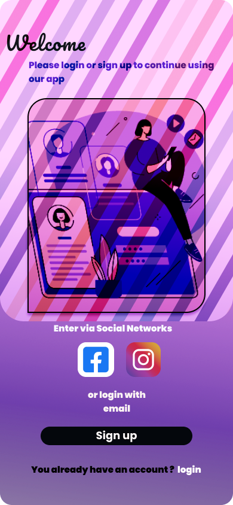
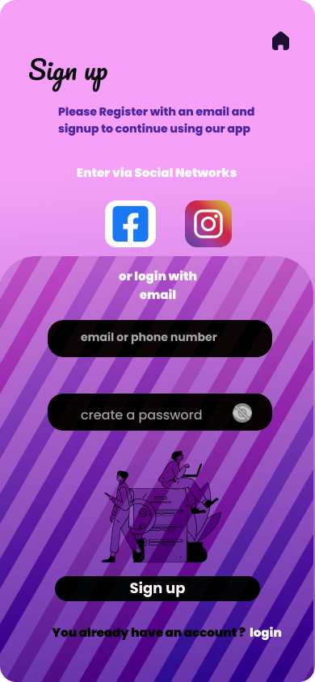
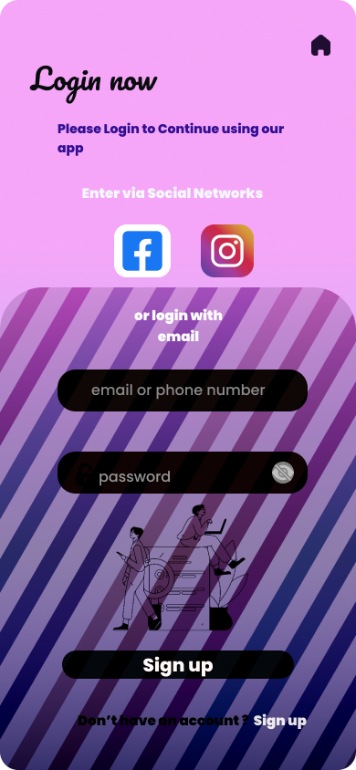

# Mobile App Login & Signup Flow

Here is the UI/UX design for a mobile application's authentication flow, created in Figma.

## Screens

### Welcome Screen

### Sign Up Screen

### Login Screen

# Mobile App Login & Signup Flow

This project showcases the UI/UX design for a mobile app's authentication process.

## Interactive Prototype

Click the image below to open the live, interactive prototype in Figma.

  <a href="https://www.figma.com/file/your-copied-link-here">
    <strong>➡️ Open Interactive Prototype</strong>
  </a>

